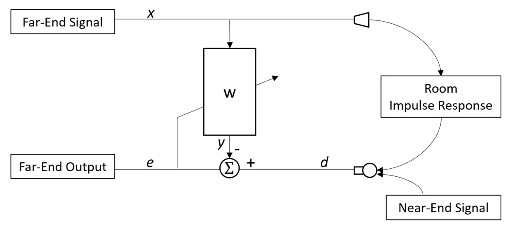

## speex的AEC过程
 
1. 输入信号为远端信号( far_end signal )和近端信号( near_end signal ), 远端信号是指扬声器发出的信号, 近端信号是指麦克风收到的
有效信号( 不包括回声 ); 近端信号和参考信号要先估计两个信号的延时, 用的是相关系数
&nbsp;
2. 线性滤波部分( W ), 计算回声和远端的最小均方差, 让回声逼近远端的声音(经过房间的响应), 然后将近端的声音减去回声逼近的部分, 得到说话人的声音; 在更新滤波器参数时, 不能出现近端信号, 所以整个参数更新的过程要快, 也就是说对于滤波器参数来说算是先验参数  
&nbsp;
3. 非线性滤波部分, 计算远端信号和近端信号的自相关功率谱, 判断近端信号夹杂有远端信号的概率;概率超过门限概率, 就需要做噪声抑制  
&nbsp;
4. 在poster_filter中做残留回声消除和噪声抑制, 认为残留回声和噪声均是噪声
   * 利用自适应系数的FIR滤波器

### MDF( Multidelayblock frequency domain adaptive filter, 分块频域自适应滤波器 )在AEC过程的作用
1. 用FFT来代替时域上的分块卷积, 减小计算复杂度
2. 根据可变步长来更新滤波器系数, 加快收敛速度, 最优步长等于残余回声方差与误差信号方差之比

````matlab
%LMS函数
function [yn,W,en]=LMS(xn,dn,M,mu,itr)
% LMS(Least Mean Squre)算法
% 输入参数:
%     xn   输入的信号序列      (列向量)
%     dn   所期望的响应序列    (列向量)
%     M    滤波器的阶数        (标量)
%     mu   收敛因子(步长)      (标量)     要求大于0,小于xn的相关矩阵最大特征值的倒数    
%     itr  迭代次数            (标量)     默认为xn的长度,M<itr<length(xn)
% 输出参数:
%     W    滤波器的权值矩阵     (矩阵)
%          大小为M x itr,
%     en   误差序列(itr x 1)    (列向量)  
%     yn   实际输出序列             (列向量)
% 参数个数必须为4个或5个
if nargin == 4                 % 4个时递归迭代的次数为xn的长度 
    itr = length(xn);
elseif nargin == 5             % 5个时满足M<itr<length(xn)
    if itr>length(xn) | itr<M
        error('迭代次数过大或过小!');
    end
else
    error('请检查输入参数的个数!');
end
% 初始化参数
en = zeros(itr,1);             % 误差序列,en(k)表示第k次迭代时预期输出与实际输入的误差
W  = zeros(M,itr);             % 每一行代表一个加权参量,每一列代表-次迭代,初始为0
% 迭代计算
for k = M:itr                  % 第k次迭代
    x = xn(k:-1:k-M+1);        % 滤波器M个抽头的输入
    y = W(:,k-1).' * x;        % 滤波器的输出
    en(k) = dn(k) - y ;        % 第k次迭代的误差
    % 滤波器权值计算的迭代式
    W(:,k) = W(:,k-1) + 2*mu*en(k)*x;
end
% 求最优时滤波器的输出序列
yn = inf * ones(size(xn));
for k = M:length(xn)
    x = xn(k:-1:k-M+1);
    yn(k) = W(:,end).'* x;
end
````

### 采用双滤波器设计
1. 采用自适应的后向滤波器和固定参数的前向滤波器
2. 当后向滤波器参数更新发散时, 使用前向滤波器的参数; 若后向滤波器更新, 则参数传递给前向滤波器, 更新前向滤波器

### 定点spx_fft的计算特点
1. 将512点的实数fft, 用256点的复数实现, 其中奇数的部分当做虚部来计算, 减小计算量
2. 因为复数的乘法计算, 等于实部*实部+虚部*虚部+2*实部*虚部, 而单位圆上的第一象限与第二象限的实部为相反数; 利用这个性质可以计算出后续频谱的数值


### 参考链接
https://www.jianshu.com/p/f2fc2ff2d70d ( **介绍speex的aec流程** )
&nbsp;
https://www.cnblogs.com/LXP-Never/p/11887511.html ( **matlab实现AEC中的自适应滤波** )