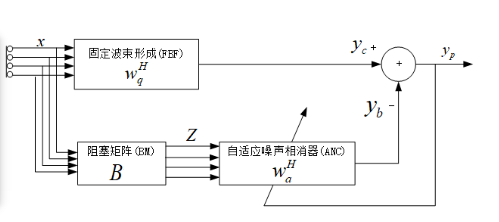

## GSC阵列信号处理算法

1. GSC主要分为BM和MC(FBF)两个处理部分，用于处理噪声与有效信号是正交不相关的情况。

2. BM是 `MICS × Block-Matric` ，阻塞矩阵部分, BM用于滤除有效信号，保留噪声信号；GSC中的BM可以是自适应的也可以是固定的。
3. MC是自适应滤波部分，消除语音信号过 `delay_sum` 之后的残留噪声信号; delay_sum就是固定波束形成，将多个麦克风收到的多个信号用不同的延时系数来实现对齐相加。
4. 滤波器参数更新的方式是NLMS，归一化自适应滤波(频域)；残差 `e(n)` 通常以复数共轭的出现，这是由复数点积的性质决定的。

