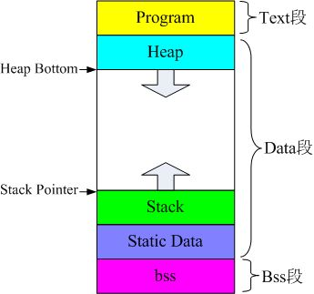

## GDB调试
* load: 指令加载
* continue: 程序一直运行
* break: 断点；`b main` 断点在main函数；`b 100` 断点在100行；`b 100 if i < 100` 在 i<100 时打断
* next: 单步执行
* step: 进入函数内部执行
* finishi: 执行完剩下子函数，返回
***


## 内存
<div align=center></div>

* **inst_mem**: 代码指令存放地址
    * text段
* **data_mem**: 数据存放地址
    * data段，heap段，stack段
    * bss(未初始化的全局变量)，rodata段(初始化的全局变量)
* **sys_mem**: 存放boot代码地址，引导程序(Bootloader)
### ld脚本
* **PROVIDE** 关键字，定义全局变量，c文件也可以引用
* `. = ALIGN(0x4)` 表示当前地址4字节对齐
* `AT` 表示**load**时的内存地址

## Cache

* CPU在往内存(src)写数据时,Cache中会缓存这些数据,并没有立即同步到DDR, 只有该地址在Cache中被换出去时候，才会同步到DDR
* Cache的映射有三种
* 在不同硬件中使用相同数据地址，需要刷cache
* 

***


## 汇编
### 编译器优化
* **-fno-schedule-insns**  关闭指令重排
* **-fntree-loop-distribute-patterns**  将for循环的部分操作转换成库函数，比如数组全0替换成memset
* **-fgcse-sm**   将load，store操作移出循环
* **-finline-limit**  编译器内联函数的指令阈值，只有小于等于阈值，才会被编译器选择内联
* **--param max-grow-copy-bb-insns**  将jump跳转的函数直接用基本块替换，省去jump指令
--------
* **.constprop** 表示函数经过常量优化，部分指令优化为常量
* **.isra** 表示删除不需要的标量，同时将部分变量传递优化成常量传递
* **.part** 表示一个大函数无法内联，只能内联其中的易于内联部分
***
<br>

### 内联汇编优化
<br>

#### **函数跳转**
1. 函数入口: 分配帧栈，保存返回地址
2. 函数结束: 恢复返回地址，释放帧栈空间，返回调用点 


* **浮点操作数** 在使用时，**constraint** (约束) 需要定义为"**f**"(浮点寄存器)，整型单元一般都是"**r**"(通用寄存器)

````c
    float32_t multAcc_32x32_float32(float32_t a, float32_t x, float32_t y, 
                                    float32_t tmp)
    {
    __asm__ volatile(
    "fmadd.s %0, %1, %2, %3\n\t"
    :"=f"(a)
    : "f"(x), "f"(y), "f"(tmp));
    return a;
    }
````
*<center>1-1</center>*

````c
inline float32_t multAcc_32x32_float32(float32_t a, float32_t x, float32_t y)
{
    __ASM volatile("fmadd.s %0, %1, %2\n\t"
                   :"=r" (a), "=r" (x), "=r" (y) : "0" (a), "1" (x), "2" (y));
    return a;
}
````
*<center>1-2</center>*

````c
    asm volatile(
                "loop:\n\t"
                "vsetvli        t0, %3, e32, m2\n\t"
                "vlw.v          v2, (%2)\n\t"
                "slli           t1, t0, 2\n\t"
                "add            %2, %2, t1\n\t"
                "vfsgnjx.vv     v4, v2, v2\n\t"
                "vsw.v          v4, (%0)\n\t"
                "add            %0, %0, t1\n\t"
                "sub            %3, %3, t0\n\t"
                "bnez           %3, loop\n\t"

                :"=r"(output_data)  // %0
                :"0"(output_data),  // %1
                "r"(input_data),    // %2
                "r"(size)           // %3
                : "v2", "v3", "v4", "v5", "t0", "t1"
    );
````
*<center>1-3</center>*

````c
    asm volatile(
            "flw    fa4, %4\n\t"
            "flw    fa5, %5\n\t"
            "flw    fa2, %2\n\t"

            "fmul.s    fa0,fa5,fa4"
            "fmul.s    fa1,fa5,fa2"
            
            "flw    fa3, %3\n\t"
            "fmsub.s    fa0,fa2,fa3,fa0\n\t"
            "fsw    fa0, %0\n\t"
            "fsw    fa1, %1\n\t"
            
            :"+m" (z[z_idx]), "+m" (z[z_idx+1])
            :"m" (x[x_idx]), "m" (y[y_idx]), "m" (x[x_idx+1]),"m" (y[y_idx+1])
            :"fa4","fa5","fa2","fa3","fa0","fa1"
    );
````
*<center>1-4</center>*


* **+** 表示该操作数既可以读也可以写；通常使用在内联汇编含多个指令的情况，需要复用该输出操作数的值
* **=** 表示该操作数可写，通常用在输出操作数
* 若操作数前面不加符号，表示只读操作数，通常用在输入操作数
* *1-2*中，出现了修饰操作数的阿拉伯数字，该约束通常和 **=** 一起使用，表示既做输入也做输出；数字约束`"0", "1", "2"`约束在早期gcc编译器中使用，表示现在可以用"+r"替换
* *1-3*, *1-4*中，在内联汇编中使用到了寄存器(指定的寄存器)，需要在最后一行冒号后面指明该寄存器的值被改变；如果像*1-2*没有特意指定寄存器，则不需要添加说明
#### 优化思路
* 多利用寄存器传值，减少load，store操作；部分函数的store指令可以移出循环外
* 指令重排，利用软件流水
* 利用特殊的指令，比如SIMD或者乘加指令
----
<br>

### **RISCV指令** (**指令分为16位和32位，所以PC指针通常+2或+4**)
#### **常用指令**
* sw: 寄存器的值存储到内存
* lw，lh: 内存的值到寄存器，lh表示只读16位(riscv中的通用寄存器都是32位)
* fsd，fsw: 浮点寄存器值到内存
* flw, fld: 内存到浮点寄存器
* slli，srli: 立即数左右移
* bnez，blez: 比较后，函数内指令跳转
* j，jar: 指令跳转，不同函数间跳转
* li: 寄存器加载立即数
* ipop，ipush: 平头哥私有指令，快速压栈/出栈，将所有的通用寄存器都保存下来，通常用于中断恢复
* ret: 返回不同函数跳转后指令调用的地方(返回栈上的地址)
#### **SIMD指令**
* kadd16: 将32位寄存器分为高低16位，然后高低16位单独相加(用于**short**整型)；与add指令不一样的地方在于，add指令是32位的加法指令

#### **Vector指令**
* 可变长的矢量寄存器，通过 `VLEN` 和 `SLEN` 参数来控制
    * `VLEM` 是矢量寄存器的位数
    * `SEW` 是单个变量所占的寄存器位数

* 可以交织读取内存中的值
* **RISCV** 可以使用矢量向量寄存器组，一次性处理多个向量寄存器数据；由 `LMUL` 决定使用的向量寄存器的个数，也可以是分数，表示只使用单个向量寄存器的高位

<br>

````c
  asm volatile(
               "mv         t4,   %[LEN]       \n\t"
               "mv         t1,   %[PA]        \n\t"
               "mv         t2,   %[PB]        \n\t"
               "mv         t3,   %[PC]        \n\t"
               "LOOP1:                        \n\t"
               "vsetvli    t0,   t4,   e32,m1 \n\t"
               "sub        t4,   t4,   t0     \n\t"
               "slli       t0,   t0,   2      \n\t" //Multiply number done by 4 bytes
               "vle.v      v0,   (t1)         \n\t"
               "add        t1,   t1,   t0     \n\t"
               "vle.v      v1,   (t2)         \n\t"
               "add        t2,   t2,   t0     \n\t"
               "vfadd.vv   v2,   v0,   v1     \n\t"
               "vse.v      v2,   (t3)         \n\t"
               "add        t3,   t3,   t0     \n\t"
               "bnez       t4,   LOOP1        \n\t"
               :
               :[LEN]"r"(len), [PA]"r"(a),[PB]"r"(b),[PC]"r"(c)
               :"cc","memory", "t0", "t1", "t2", "t3", "t4",
                "v0", "v1", "v2"
               );
````


* `m1` 表示 `LMUL` 只使用1个向量寄存器；`e32` 代表单个向量的位数；`t0` 是返回的向量个数值
* `t4` 是需要计算的所有向量的长度；`vse` 是向量写回指令；`vle` 是向量读取指令
* `vsetvli` 指令需要在所有向量指令之前

<br>

````c
void riscv_cmplx_conj_q15(
  const q15_t * pSrc,
        q15_t * pDst,
        uint32_t numSamples)
{
#if defined(RISCV_VECTOR)
  uint32_t blkCnt = numSamples;                               /* Loop counter */
  size_t l;
  l = vsetvl_e32m8(blkCnt);
  const q15_t * input = pSrc;
  q15_t * output = pDst;
  ptrdiff_t bstride = 4;
  vint16m8_t v_R,v_I;
  vint16m8_t v0;
  v0 = vxor_vv_i16m8(v0, v0, l);                   /* vector 0 */
  for (; (l = vsetvl_e16m8(blkCnt)) > 0; blkCnt -= l) 
  {
    v_R = vlse16_v_i16m8(input, bstride, l);
    input++;
    vsse16_v_i16m8 (output, bstride, v_R, l);
    output++;
    v_I = vsub_vv_i16m8(v0, vlse16_v_i16m8(input, bstride, l), l);
    input += (l*2-1);
    vsse16_v_i16m8 (output, bstride, v_I, l);
    output += (l*2-1);
  }
````

````c
    # Vector strided loads and stores

    # vd destination, rs1 base address, rs2 byte stride
    vlse8.v    vd, (rs1), rs2, vm  #    8-bit strided load
    vlse16.v   vd, (rs1), rs2, vm  #   16-bit strided load
    vlse32.v   vd, (rs1), rs2, vm  #   32-bit strided load
    vlse64.v   vd, (rs1), rs2, vm  #   64-bit strided load
    vlse128.v  vd, (rs1), rs2, vm  #  128-bit strided load
    vlse256.v  vd, (rs1), rs2, vm  #  256-bit strided load
    vlse512.v  vd, (rs1), rs2, vm  #  512-bit strided load
    vlse1024.v vd, (rs1), rs2, vm  # 1024-bit strided load

    # vs3 store data, rs1 base address, rs2 byte stride
    vsse8.v    vs3, (rs1), rs2, vm  #    8-bit strided store
    vsse16.v   vs3, (rs1), rs2, vm  #   16-bit strided store
    vsse32.v   vs3, (rs1), rs2, vm  #   32-bit strided store
    vsse64.v   vs3, (rs1), rs2, vm  #   64-bit strided store
    vsse128.v  vs3, (rs1), rs2, vm  #  128-bit strided store
    vsse256.v  vs3, (rs1), rs2, vm  #  256-bit strided store
    vsse512.v  vs3, (rs1), rs2, vm  #  512-bit strided store
    vsse1024.v vs3, (rs1), rs2, vm  # 1024-bit strided store
````

* `bstride` 用于交织读取